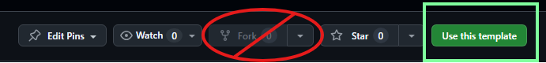

> ⚠️ **Don't click Fork!**
> 
> This is a GitHub Template repo. If you want to use this for a plugin, [use this template][new-repo] to make a new repo!
>
> 

<div align="center">

<span></span>

  
### NNekoTemplate


[](https://github.com/NNekoPlugins/NNekoTemplate/releases/latest)

**[Issues](https://github.com/NNekoPlugins/NNekoTemplate/issues) · [Pull Requests](https://github.com/NNekoPlugins/NNekoTemplate/pulls) · [Releases](https://github.com/NNekoPlugins/NNekoTemplate/releases/latest)**

</div>

---

## About 


## Features


## Installation
> **Warning**  
> No support will be provided on any Dalamud official support channel. Please use the [Issues](https://github.com/NNekoPlugins/NNekoTemplate/issues) page for any support requests. Do NOT ask for support anywhere else, as support for 3rd-party plugins is not provided by the Dalamud team. 
> 
> Additionally, you should understand that this plugin could be detected by other players or a GM, use at your own risk.

This plugin can be installed as a 3rd-party plugin via the Dalamud Plugin Installer. To do so, add the following URL to `Settings > Experimental > Custom Plugin Repositories`:

```
https://raw.githubusercontent.com/NNekoPlugins/NNekoTemplate/main/repo.json
```
